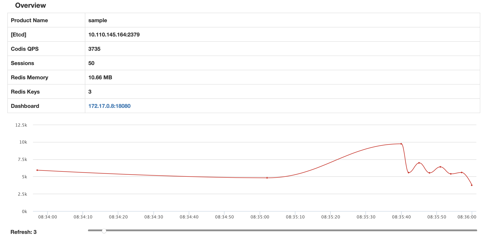

# Codis-Operator

Codis Operator creates and manages codis clusters running in kubernetes.(WIP)

## Advantages based on k8s

### NO SPOF RISK

Codis dashboard component which does migration/cluster management work is a spof, if it is deployed by traditional method and when it fails, we have to recover it manually,however,it will be self-healing based on k8s.

### Easily Create/Maintain Cluster

Codis Cluster has a lots of components(proxy/dashboard/redis/fe/sentinel).it will cost a lot of time if it is deployed and managed by traditional method,especially when nodes die,cut off,we have to recover/migrate every component manually.however,we can easily deploy/destory cluster with only one command based on k8s,and when proxy/dashboard/fe fails(node die,outage,node cut,node resource exhaustion),all these failures will be self-healing that saves much time.

## Feature

### Create and Destroy Codis Cluster

Deploy/Destroy cluster with only one comannd
	
### Scaling the Codis Cluster 

Automatically scales the proxy component

### Automatic FailOver

Automatically performs failover when proxy/dashboard/fe failed.

### Automatically monitoring Codis Cluster

Automatically deploy Prometheus,Grafana for Codis cluster monitoring.

## Getting Start(Demo)


## OverView 


### Deploy Codis Operator
	
```
kubectl create -f ./deploy/manager/deployment-dev.yml
```

### Create and destroy a codis cluster

```
kubectl create -f ./examples/sample-1.yml
```

```
kubectl delete -f ./examples/sample-1.yml
```

### Best Practices

* specifying coordinator name to etcd/zookeeper

* use pv to store Redis data(ssd disk is better) 

* use dedicated node to run codis-server(Redis)

* set max memory limit(node memory) for codis-server and assign enough memory 

* make sure request resource and limit source are equal(k8s pod qos is guaranteed,evict/oom seldom happens)

* it is better that if your pod ip is sticky. 

### EXAMPLES

reference linking: 

https://github.com/tangcong/codis-operator/blob/master/examples/sample-3.yml

* using pv(specifying storageClassName)

* enabling hpa

* specifying service type

* specifying coordinator name 

* specifying request/limit resource 

* specifying scheduler policy(node selector/tolerations)


### To do List

* monitor(proxy/redis)

* dedicated scheduler server(k8s do not know "codis group" conception, one group may have 2-N replicas, we want to make sure that every codis server pod which is in the same group be scheduled into different node, when one node crash/outage,we can promote other slave to master.)

* make sure that drain node safely and automatically.

* support helm

* support local pv

* add unit test

* add e2e test

* add chaos test

### SNAPSHOTS




